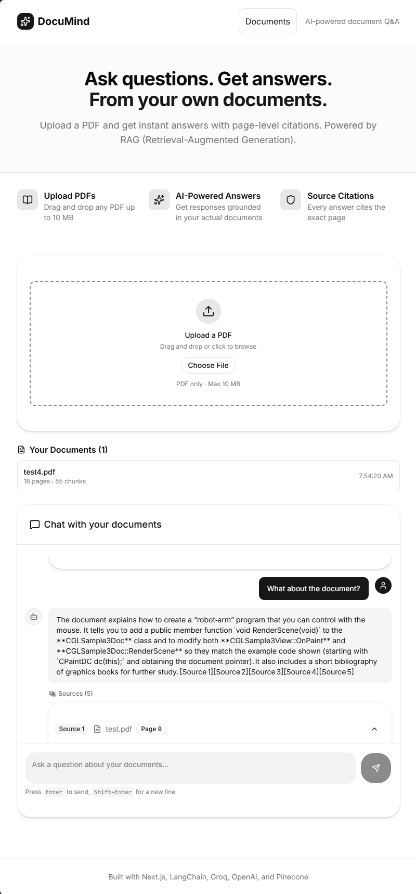

# 🧠 DocuMind — AI-Powered Document Q&A

An intelligent document assistant that lets you upload PDFs and ask questions in natural language. Get instant answers with **page-level citations**, powered by **RAG (Retrieval-Augmented Generation)** — no hallucinations, only grounded responses.

[](https://documind-seven-sable.vercel.app)
[](https://nextjs.org/)
[](https://www.typescriptlang.org/)
[](https://ui.shadcn.com/)
[](https://js.langchain.com/)
[](https://groq.com/)
[](https://openai.com/)
[](https://pinecone.io/)
[](https://opensource.org/licenses/MIT)

<br />

## 🚀 Live Demo

▶️ **Try it now:** [https://documind-seven-sable.vercel.app](https://documind-seven-sable.vercel.app)

📷 **Screenshot:** *Upload a PDF, ask a question, get an answer with citations.*




<br />

## ✨ Features

### 📄 Document Ingestion
- **Drag-and-Drop Upload** — Drop any PDF up to 10 MB
- **Smart Parsing** — Extracts text from every page (preserves page numbers)
- **Intelligent Chunking** — Splits text into ~1000-char overlapping chunks
- **Vector Embeddings** — Converts text to 1536-dimensional vectors via OpenAI
- **Pinecone Storage** — Stores vectors with rich metadata (document, page, chunk)

### 💬 Conversational Q&A
- **Natural Language Queries** — Ask questions like you're talking to a human
- **Semantic Search** — Finds the most relevant chunks (not just keyword matching)
- **Grounded Answers** — Powered by Llama on Groq via LangChain
- **Page-Level Citations** — Every answer cites the exact page and document
- **Anti-Hallucination** — Refuses to answer if the information isn't in the docs
- **Expandable Sources** — Click to see the exact source text

### 📚 Document Management
- **Documents Dashboard** — View all uploaded documents in one place
- **Document Metadata** — See page count, chunk count, and upload date
- **Delete Documents** — Remove documents from Pinecone with confirmation
- **Persistent Storage** — Document list saved to `localStorage`

### 🎨 Modern UI
- **shadcn/ui Components** — Beautiful, accessible UI primitives
- **Dark Mode Ready** — CSS variables for easy theming
- **Responsive Design** — Works on mobile, tablet, and desktop
- **Smooth Animations** — Loading skeletons, toast notifications
- **Real-time Feedback** — See upload progress and query status

<br />

## 🛠️ Tech Stack

| Category | Technologies |
|----------|--------------|
| **Frontend** | Next.js 16, React 19, TypeScript, Tailwind CSS |
| **UI Components** | shadcn/ui, Radix UI, Lucide Icons |
| **RAG Framework** | LangChain.js |
| **LLM** | Groq (OpenAI GPT-OSS 120B) |
| **Embeddings** | OpenAI `text-embedding-3-small` |
| **Vector DB** | Pinecone |
| **PDF Parsing** | `pdf-parse-new` |
| **Deployment** | Vercel |
| **Package Manager** | npm |

<br />

## 🏗️ Architecture

### RAG Pipeline

```
┌─────────────────────────────────────────────────────────────┐
│                    INGESTION PIPELINE                       │
├─────────────────────────────────────────────────────────────┤
│                                                             │
│  📄 PDF Upload  →  📖 Parse Pages  →  ✂️ Chunk Text        │
│         ↓                                                   │
│  🧠 OpenAI Embeddings  →  💾 Pinecone Storage              │
│                                                             │
└─────────────────────────────────────────────────────────────┘

┌─────────────────────────────────────────────────────────────┐
│                    QUERY PIPELINE                           │
├─────────────────────────────────────────────────────────────┤
│                                                             │
│  ❓ User Question  →  🧠 Embed Question                    │
│         ↓                                                   │
│  🔍 Pinecone Search (Top 5)  →  📚 Relevant Chunks         │
│         ↓                                                   │
│  🎯 Groq LLM + Prompt  →  💬 Answer with Citations         │
│                                                             │
└─────────────────────────────────────────────────────────────┘
```

### Tech Flow

```
User → Next.js Frontend → API Route → LangChain → Groq LLM
                                       ↓
                                  OpenAI Embeddings
                                       ↓
                                  Pinecone Vector DB
```

<br />

## 📁 Project Structure

```
documind/
├── src/
│   ├── app/
│   │   ├── api/
│   │   │   ├── upload/
│   │   │   │   └── route.ts              # PDF upload & embedding
│   │   │   ├── query/
│   │   │   │   └── route.ts              # RAG query endpoint
│   │   │   └── documents/
│   │   │       └── [documentId]/
│   │   │           └── route.ts          # Document deletion
│   │   ├── documents/
│   │   │   └── page.tsx                  # Documents list page
│   │   ├── layout.tsx
│   │   ├── page.tsx                      # Main chat page
│   │   └── globals.css
│   ├── components/
│   │   ├── ui/                           # shadcn/ui components
│   │   │   ├── button.tsx
│   │   │   ├── card.tsx
│   │   │   ├── input.tsx
│   │   │   ├── label.tsx
│   │   │   ├── textarea.tsx
│   │   │   ├── tabs.tsx
│   │   │   ├── scroll-area.tsx
│   │   │   ├── badge.tsx
│   │   │   ├── separator.tsx
│   │   │   ├── avatar.tsx
│   │   │   ├── alert-dialog.tsx
│   │   │   ├── skeleton.tsx
│   │   │   ├── sonner.tsx
│   │   │   └── ...
│   │   ├── FileUpload.tsx                # Drag-and-drop upload
│   │   ├── ChatInterface.tsx             # Chat UI
│   │   ├── MessageBubble.tsx             # Message display
│   │   └── SourceCard.tsx                # Citation display
│   ├── lib/
│   │   ├── rag/
│   │   │   ├── config.ts                 # RAG configuration
│   │   │   ├── embeddings.ts             # OpenAI embeddings
│   │   │   ├── vectorstore.ts            # Pinecone client
│   │   │   ├── chunking.ts               # Text splitter
│   │   │   ├── llm.ts                    # Groq LLM
│   │   │   └── pdf.ts                    # PDF parser
│   │   └── utils.ts                      # shadcn cn() helper
│   └── types/
│       └── index.ts                      # TypeScript types
├── scripts/
│   └── list-models.ts                    # Groq model discovery
├── .env.local
├── components.json                       # shadcn/ui config
├── next.config.ts
├── tailwind.config.js
├── vercel.json
└── package.json
```

<br />

## 🚀 Getting Started

### Prerequisites

- [Node.js](https://nodejs.org/) (v18 or higher)
- [npm](https://www.npmjs.com/) or [yarn](https://yarnpkg.com/)
- **Groq API Key** (free) — [console.groq.com](https://console.groq.com)
- **OpenAI API Key** (paid, ~$0.02/1M tokens) — [platform.openai.com](https://platform.openai.com)
- **Pinecone API Key** (free tier) — [pinecone.io](https://pinecone.io)

### Installation

1. **Clone the repository**
   ```bash
   git clone https://github.com/tolkensak/documind.git
   cd documind
   ```

2. **Install dependencies**
   ```bash
   npm install
   ```

3. **Set up environment variables**

   Create a `.env.local` file:
   ```env
   # Groq (free LLM)
   GROQ_API_KEY="gsk_..."
   GROQ_MODEL="openai/gpt-oss-120b"

   # OpenAI (embeddings)
   OPENAI_API_KEY="sk-..."

   # Pinecone (vector DB)
   PINECONE_API_KEY="pcsk_..."
   PINECONE_INDEX_NAME="documind"
   ```

4. **Set up Pinecone**
   - Create a free account at [pinecone.io](https://pinecone.io)
   - Create an index named `documind` with:
     - **Dimensions:** 1536
     - **Metric:** cosine
     - **Cloud:** AWS (us-east-1)

5. **Run the development server**
   ```bash
   npm run dev
   ```

6. **Open your browser**
   Navigate to [http://localhost:3000](http://localhost:3000)

<br />

## 📚 Usage Guide

### 1. Upload a PDF
- Drag and drop a PDF onto the upload area, or click "Choose File"
- Wait for parsing, embedding, and storage (takes 5-30 seconds)
- See a toast notification when complete

### 2. Ask Questions
- Type your question in the chat input
- Press **Enter** to send (or **Shift+Enter** for a new line)
- See the AI answer with source citations

### 3. Explore Sources
- Click the **▼** on any source card to expand it
- See the exact text from the document
- Note the page number for reference

### 4. Manage Documents
- Click **Documents** in the header
- View all uploaded PDFs
- Delete documents with the trash icon

### 5. Test Anti-Hallucination
- Ask a question that's NOT in the document
- The AI will respond: *"I couldn't find that information in the document."*

<br />

## 🎯 Why This Project Stands Out

### Technical Depth
- **RAG Pipeline** — Full ingestion + query flow from scratch
- **Vector Search** — Semantic similarity, not keyword matching
- **Anti-Hallucination** — Guards against made-up answers
- **Source Citations** — Every answer is verifiable
- **Production-Ready** — Deployed and working on Vercel

### Engineering Quality
- **Type Safety** — Full TypeScript coverage
- **Modular Architecture** — Clean separation of concerns
- **Reusable Components** — shadcn/ui + custom components
- **Error Handling** — Graceful failures with toasts
- **Professional UI** — Beautiful, accessible design

### Market Relevance
- **AI/LLM Integration** — Hot skill in 2026
- **Vector Databases** — Modern data infrastructure
- **RAG Systems** — Used by every major AI company
- **Full-Stack** — Frontend + Backend + AI

<br />

## 🔧 Environment Variables

| Variable | Description | Required |
|----------|-------------|----------|
| `GROQ_API_KEY` | Groq API key | ✅ Yes |
| `GROQ_MODEL` | LLM model to use | Optional (`openai/gpt-oss-120b`) |
| `OPENAI_API_KEY` | OpenAI API key | ✅ Yes |
| `PINECONE_API_KEY` | Pinecone API key | ✅ Yes |
| `PINECONE_INDEX_NAME` | Pinecone index name | ✅ Yes |

<br />

## 🧪 Testing the App

### Try These Sample Questions
Once you've uploaded a PDF, try:

| Question | What You Should See |
|----------|---------------------|
| "What is this document about?" | Summary with citations |
| "What are the main points?" | Structured list |
| "What numbers are mentioned?" | Extracted data |
| "What is the recipe for cake?" | *"I couldn't find that information"* |

<br />

## 📦 Deployment

### Deploy to Vercel

1. **Push to GitHub**
   ```bash
   git add .
   git commit -m "Initial commit"
   git push
   ```

2. **Import on Vercel**
   - Go to [vercel.com/new](https://vercel.com/new)
   - Select your repository
   - Add environment variables
   - Deploy!

3. **Important Vercel Config**
   - `serverExternalPackages: ['pdf-parse-new']` in `next.config.ts`
   - `maxDuration: 10` for API routes (Hobby tier limit)
   - `vercel.json` with function configs

<br />

## 🤝 Contributing

Contributions are welcome!

1. Fork the repository
2. Create a feature branch: `git checkout -b feature/amazing-feature`
3. Commit your changes: `git commit -m 'Add amazing feature'`
4. Push to the branch: `git push origin feature/amazing-feature`
5. Open a Pull Request

<br />

## 📄 License

This project is licensed under the MIT License — see the [LICENSE](LICENSE) file for details.

<br />

## 🙏 Acknowledgments

- [LangChain.js](https://js.langchain.com/) — RAG orchestration
- [Groq](https://groq.com/) — Blazing-fast LLM inference
- [OpenAI](https://openai.com/) — High-quality embeddings
- [Pinecone](https://pinecone.io/) — Managed vector database
- [shadcn/ui](https://ui.shadcn.com/) — Beautiful UI components
- [Vercel](https://vercel.com/) — Zero-config deployment

<br />

## 🔗 Links

- **Live Demo:** [https://documind-seven-sable.vercel.app](https://documind-seven-sable.vercel.app)
- **GitHub Repository:** [https://github.com/tolkensak/documind](https://github.com/tolkensak/documind)
- **GitHub Portfolio:** [https://tolkensak.github.io/tolkensak](https://tolkensak.github.io/tolkensak)
- **LinkedIn:** [https://www.linkedin.com/in/tolkyn-akhmetollauly-0a3873a9/](https://www.linkedin.com/in/tolkyn-akhmetollauly-0a3873a9/)

<br />

---

Built with ❤️ by [Tolkyn Akhmetollauly](https://github.com/tolkensak)
